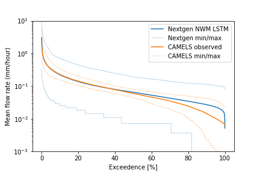

# Analysis of the LSTM for Nextgen National Water Model
The US Geological Survey (USGS) utilizes a network of stream gauges that cover an average catchment area of 167 km² to monitor water flow across the U.S. However, in the Next Generation Water Model (Nextgen), models are applied to much smaller catchments than those traditionally gauged. This study demonstrates that a machine learning model known as Long Short-Term Memory (LSTM) trained on larger, gauged catchment data can be effectively downscaled to predict streamflows in the finer-scale catchments of the Nextgen hydrofabric.  

In the HUC 01 region of New England, characterized by its post-glacial landscape with thin, coarse soils and significant groundwater contributions to streamflow, the LSTM was applied across approximately 10,000 catchments covering over 191,020 km². This region includes diverse hydrologic conditions, driven by snowmelt and various rainfall events. When comparing the flow duration curves (FDCs) from these smaller catchments with those from larger, comparable CAMELS basins, the LSTM predictions align well with observed high flows but tend to overestimate low flows—a common challenge in hydrological modeling due to the model’s sensitivity to low flow dynamics. The variability in the FDCs predicted by the LSTM across these many small catchments is expected, given their number and the broad range of hydrologic conditions they encompass.

## Contents
* HUC01_catchment_outputs.ipynb. This is a python notebook to explore and analyze the runoff that is predicted from the two-three year simulation of HUC 01 (New England).
* lstm_agu.gif: animation of the two month LSTM simulation over New England.

# See these other repositories for more information
[NeuralHydrology](https://neuralhydrology.readthedocs.io/en/latest/)
[CAMELS dataset from NCAR](https://ral.ucar.edu/solutions/products/camels)
[Next Generation U.S. National Water Model](https://github.com/NOAA-OWP/ngen)

# References
Frame, J. M., Araki, R., Bhuiyan, S. A., Bindas, T., Rapp, J., Bolotin, L., Deardorff, E., Liu, Q., Haces-Garcia, F., Liao, M., Frazier, N., & Ogden, F. L. (2024). Machine learning for a heterogeneous water modeling framework. Presented at CIROH Developers Conference, Salt Lake City, Utah. Manuscript submitted for publication, Journal of The American Water Resources Association. Based on NWC Summer Institute capstone reports from 2021-2023.  

Jonathan M. Frame, 2022, “Deep Learning for Operational Streamflow Forecasts: A Long Short-Term Memory Network Rainfall-Runoff Module for The National Water Model”. Dissertation: University of Alabama Department of Geological Sciences. [Link](https://ir.ua.edu/bitstream/handle/123456789/9436/u0015_0000001_0004409.pdf)  

Frame, J. M., Flowers, T., Ogden, F. L., Peckham, S. D., Bartel, R., Johnson, D. W., Frazier, N. J., Halgren, J. S., Mattern, D., Cui, S., Kratzert, F., & Nearing, G. S. (2021, December 17). Deep learning for the Next Generation U.S. National Water Model. Paper presented at the AGU Fall Meeting 2021, Room 271-273, Convention Center. [Link](https://agu.confex.com/agu/fm21/meetingapp.cgi/Paper/859605)  